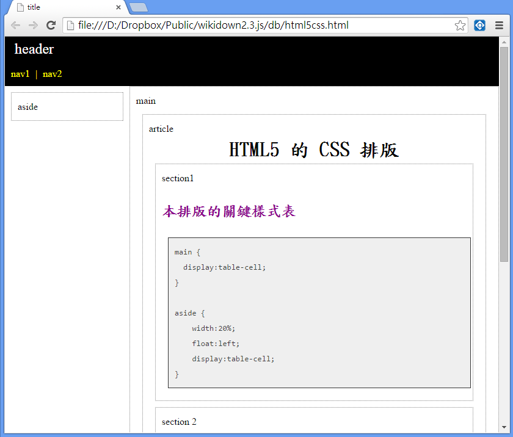

# HTML5的 CSS 版面範例

範例網址:  @[[html5css.html]](code/html5css/html5css.html)


## 顯示結果



## 檔案:  html5css.htm

```html
<html>
<head>
	<meta charset="utf-8">
	<link href="html5css.css" rel="stylesheet">
	<title>title</title>
</head>
<body>
	<header>header</header>
	<nav><a href="1.html">nav1</a> | <a href="2.html">nav2</a></nav>
	<aside>aside</aside>
	<main>
		main

		<article>
article
<h1>HTML5 的 CSS 排版</h1>

<section>

section1

<h2>本排版的關鍵樣式表</h2>

<pre>
main {
  display:table-cell;  
}

aside {
    width:20%;
    float:left;
    display:table-cell;
}
</pre>	
</section>

<section>
section 2

<h2>參考:</h2>
<ol>
<li>section 和 article 的分別請參考 <a href="http://stackoverflow.com/questions/7549561/section-vs-article-html-5">http://stackoverflow.com/questions/7549561/section-vs-article-html-5</a>
</li>
<li>main 和 aside 的區分採用 display:table-cell; <a href="http://stackoverflow.com/questions/1032914/how-to-make-a-div-to-fill-a-remaining-horizontal-space-a-very-simple-but-annoyi">http://stackoverflow.com/questions/1032914/how-to-make-a-div-to-fill-a-remaining-horizontal-space-a-very-simple-but-annoyi</a></li>
<li>HTML5 語意元素的配置 1 -- <a href="http://www.w3schools.com/html/html5_semantic_elements.asp">http://www.w3schools.com/html/html5_semantic_elements.asp</a></li>
<li>HTML5 語意元素的配置 2 -- <a href="http://www.w3schools.com/html/tryit.asp?filename=tryhtml_layout_divs">http://www.w3schools.com/html/tryit.asp?filename=tryhtml_layout_divs</a></li>
<li>HTML5 語意元素的配置 3 -- <a href="http://www.expression-web-tutorial.com/Structural-Semantic-Elements.html#.VP_gDvmUdNc">http://www.expression-web-tutorial.com/Structural-Semantic-Elements.html#.VP_gDvmUdNc</a></li>
</ol>
</section>
		</article>
	</main>
	<footer>footer</footer>
</body>
</html>
```

## 檔案:  html5css.css

```css
/* ==================== pmag.css ===========================*/
html, body, header, footer, aside {
  margin: 0;
  padding: padding 8px 16px 8px 16px;
  border: 0;
  font: inherit;
  vertical-align: baseline;
  line-height:160%;
}

body {
  overflow-y: scroll;
  width:100%;
}

header, footer {
  margin: 0;
  padding: 8px 16px 8px 16px;
  border: 0;
  font: inherit;
  vertical-align: baseline;
}

header {
  background-color:black;
  color:white;
  font-size: 150%;
}

nav, nav a {
    line-height:30px;
    color:yellow;
    background-color:black;
    padding:5px;        
}

main, div, aside, article, section {
  margin:10px;
  padding:10px;    
  border: #888888 1px dotted;    
}

main {
  display:table-cell;  
}

aside {
    width:20%;
    float:left;
    display:table-cell;
}

footer {
    color:#888888;
    clear:both;
    text-align:center;
    padding:5px; 
    border-top: #888888 1px dotted;  
}
header p {
  color: #aaaaaa;
}

header a {
  color: #eeeeee;
  font-family: '標楷體', 'Times New Roman';
}

h1, h1 a { font-size: xx-large; color:#050505; text-align:center; margin:10px; font-weight: bold; font-family: 'DFKai-sb', 'Tahoma'; }

h2, h2 a { font-size: x-large; color:#8B008B; margin-top:30px; margin-bottom:30px; font-weight: bold; font-family: 'DFKai-sb', 'Tahoma'; }

h3, h3 a { font-size: large; color:#000080; font-weight: bold; font-family: 'DFKai-sb', 'Tahoma'; }

h4, h4 a { font-size: medium;  color:#4B0082; font-weight: bold; font-family: 'DFKai-sb', 'Tahoma'; }

h5, h5 a { font-size: small ;  color:#708090; font-weight: bold; font-family: 'DFKai-sb', 'Tahoma'; }

h6, h6 a { font-size: x-small; color:#000080; }

blockquote {
  margin: 10px;
  padding: 10px;
  border: 3px double #373737;
  color:#333333;
}

p {
  margin: 10px 0 15px 0;
  color:#353535;
}

a {
  text-decoration: none;
  color: #007edf;
  text-shadow: none;
  transition: color 0.5s ease;
  transition: text-shadow 0.5s ease;
}

a:hover {
  text-shadow: 2px 2px 8px #33aeff;
//  text-shadow: 0px 0px 15px #FF37FD;
//  text-shadow: 5px 5px 13px rgba(88, f0, ff, 1);
//  text-shadow: 2px 2px 8px rgba(86, 84, 150, 1);
// 陰影產生器 -- http://css3gen.com/text-shadow/
}

table {
  border-collapse: collapse;
  border-spacing: 0;
  border: 1px solid #373737;
  margin-bottom: 20px;
  text-align: left;
  margin-left:auto; 
  margin-right:auto;
}

th {
	padding: 10px;
	background-color:black;
	color:white;
}

td {
  padding: 10px;
  vertical-align: middle;
  border: 1px solid #373737;
}

em {
  color: blue;
}

strong {
  font-weight:bold;
  color: red;
}


pre {
  border: 1px solid #373737;
  background-color:#efefef;
  color:#3f3f3f;
  font-size:medium;
  width:95%;
  padding:10px;
  margin:10px;
  /* wrap ，自動換行 */
  white-space: pre-wrap;       /* css-3 */
  white-space: -moz-pre-wrap;  /* Mozilla, since 1999 */
  white-space: -pre-wrap;      /* Opera 4-6 */
  white-space: -o-pre-wrap;    /* Opera 7 */
  word-wrap: break-word;       /* Internet Explorer 5.5+ */    
}

pre code, code {
  font-family: SimSun;
  font-size:125%;
}

img, .figure, .figure img {
  margin:10px;
  padding:10px;
  margin-left: auto;
  margin-right: auto;
  display: block;
}

.figure .caption {
  text-align:center;
}

/* JavaScript Style */
table.sourceCode, tr.sourceCode, td.lineNumbers, td.sourceCode {
  margin: 0; padding: 0; vertical-align: baseline; border: none; }
table.sourceCode { width: 100%; }
td.lineNumbers { text-align: right; padding-right: 4px; padding-left: 4px; color: #afafaf; border-right: 1px solid #aaaaaa; }
td.sourceCode { padding-left: 5px; }
code > span.kw { color: #007020; font-weight: bold; }
code > span.dt { color: #902000; }
code > span.dv { color: #40a070; }
code > span.bn { color: #40a070; }
code > span.fl { color: #40a070; }
code > span.ch { color: #4070a0; }
code > span.st { color: #4070a0; }
code > span.co { color: #60a0b0; font-style: italic; }
code > span.ot { color: #007020; }
code > span.al { color: #ff0000; font-weight: bold; }
code > span.fu { color: #06287e; }
code > span.er { color: #ff0000; font-weight: bold; }
```
